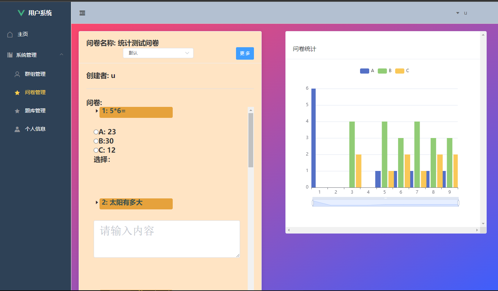

:::info 目录
**在ECS上部署前后端分离项目**   

**部署流程**    
::: -->
<!--truncate-->


<!--  
 project address: 8.130.30.42:8080 -->


### 在ECS上部署前后端分离项目

 address [http://8.130.30.42:8080 ](http://8.130.30.42:8080)


  project screenshot：



### 部署流程
1、在ecs上重置密码，使用ssh连接  
2、安装**xshell**,进行远程控制，**WinSCP**进行文件传输  
3、导入jdk,配置jdk,安装mysql,建立root用户，初始化表  
4、新建start.sh ： java -jar qsdemo.jar  
5、导入qsdemo.jar，执行 nohup  ./start.sh & 持续运行,后端完成  
6、安装nginx,设置端口8080，将vue构建后的dist导入nginx/html中，启动nginx  
7、开启所用的所有端口  
8、**跨域修改前端后端localhost**   

### 2023-06-02 error log
ecs中mysql数据清空（？）   
重新导入数据：  
create database qssql;  
source /root/qssql.sql;   

### 2023-06-07 updata log
``` sql title="将root权限设置为localhost"
use mysql;
update user set authentication_string='' where user='root';
flush privileges;
ALTER USER 'root'@'localhost' IDENTIFIED BY '123456' PASSWORD EXPIRE NEVER; 
alter user 'root'@'localhost' identified by '123456';
grant all privileges  on *.*  to "root"@'localhost';
flush privileges;
net start mysql
```

 
