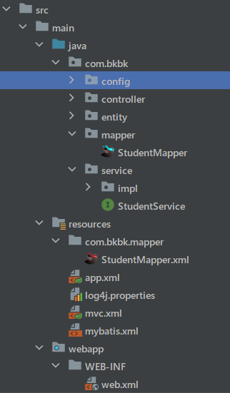
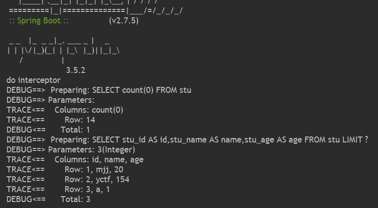

 

:::danger 目录
**Spring**  
 
**SpringMvc**    
 
**SSM+SpringBoot**    
 
**SpringBoot框架**    
  
::: -->
<!--truncate-->
 


# Spring


## Spring  
### Spring框架IOC和DI  
略  
### 容器配置类和组件扫描 
``` xml
<?xml version="1.0" encoding="UTF-8"?>
<beans xmlns="http://www.springframework.org/schema/beans"
       xmlns:context="http://www.springframework.org/schema/context"
       xmlns:tx="http://www.springframework.org/schema/tx"
       xmlns:xsi="http://www.w3.org/2001/XMLSchema-instance"
       xsi:schemaLocation="http://www.springframework.org/schema/beans
       http://www.springframework.org/schema/beans/spring-beans.xsd
 http://www.springframework.org/schema/tx
        http://www.springframework.org/schema/tx/spring-tx.xsd
         http://www.springframework.org/schema/context
        http://www.springframework.org/schema/context/spring-context.xsd">

    <context:component-scan base-package="com.bkbk"></context:component-scan>


    <!--    <mvc:resources mapping="/img/**" location="/img/"></mvc:resources>-->
    <!--    <mvc:resources mapping="/**" location="/"></mvc:resources>-->

    <bean id="dataSource" class="com.alibaba.druid.pool.DruidDataSource">
        <property name="driverClassName" value="com.mysql.cj.jdbc.Driver"></property>
        <property name="url" value="jdbc:mysql://localhost:3306/school"></property>
        <property name="username" value="root"></property>
        <property name="password" value="root"></property>
    </bean>

    <bean  id="sessionFactory" class="org.mybatis.spring.SqlSessionFactoryBean">
        <property name="dataSource" ref="dataSource"></property>
        <property name="configLocation"  value="classpath:mybatis.xml"></property>
    </bean>

    <bean class="org.mybatis.spring.mapper.MapperScannerConfigurer">
        <property name="sqlSessionFactoryBeanName" value="sessionFactory"></property>
        <property name="basePackage" value="com.bkbk.mapper"></property>
    </bean>


    <bean id="transactionManager" class="org.springframework.jdbc.support.JdbcTransactionManager">
        <property name="dataSource" ref="dataSource"></property>
    </bean>

    <tx:annotation-driven></tx:annotation-driven>

</beans>


```

### 自动装配 

```
@Autowired
自动注入的意思，标注在属性上也可以标注在方法上标注在属性上， spring的ioc使用的是反射暴力破解
ioc容器会按类型去匹配，匹配到一个正常注入，匹配不到或者匹配到多个报错配合@Qualifier注解可以实现按名字注入
@Resource
按名字注入，如果你给了名字按照你给的名字去找，没给名就用被标注的属性名字，如果名字找不到就会按类型去匹配
```


### 注解开发  
``` js
@Target(value = {ElementType.FIELD，ElementType.TYPE})//这个注解可以使用在哪   
@Retention(value = RetentionPolicy.RUNTIME)// 注解保留到什么时间
public @interface Table {
  string value() default "asdfg";
  string[] name();
} 
```
### AOP处理日志记录 
Spring默认使用jdk动态代理，自由式需要AspectJ依赖  
jdk动态代理：  
``` js
public interface Eat {
    abstract  void eat();
}

public class Person implements Eat {
    @Override
    public void eat() {
      System.out.println("person eating!");
    }
}

public class MyProxy<T> implements InvocationHandler {

    private T target;

    public MyProxy(T target){
        this.target = target;
    }

    @Override
    public Object invoke(Object proxy, Method method, Object[] args) throws Throwable {
        System.out.println("aaa");
        method.invoke(target,args);
        System.out.println("aaabbb");
        return  null;
    }
}

public class test {
    public static void main(String[] args) {

        Person person = new Person();
        MyProxy proxy = new MyProxy<Eat>(person);


        //创建代理对象,代理对象的每个执行方法都会替换执行Invocation中的invoke方法
        Eat x = (Eat) Proxy.newProxyInstance(Eat.class.getClassLoader(),new Class<?>[]{Eat.class}, proxy);

        x.eat();

        //也可以使用下面的方式创建代理类对象，Proxy.newProxyInstance其实就是对下面代码的封装
		/*try {
			//使用Proxy类的getProxyClass静态方法生成一个动态代理类renterProxy
			Class<?> renterProxyClass = Proxy.getProxyClass(Person.class.getClassLoader(), new Class<?>[]{Person.class});
			//获取代理类renterProxy的构造器，参数为InvocationHandler
			Constructor<?> constructor = renterProxyClass.getConstructor(InvocationHandler.class);
			//使用构造器创建一个代理类实例对象
			Person renterProxy = (Person)constructor.newInstance(renterHandler);
			renterProxy.rentHouse();
			//
		} catch (Exception e) {
			e.printStackTrace();
		}*/
    }
}
```

xml配置aop
``` xml
<?xml version="1.0" encoding="UTF-8"?>
<beans xmlns="http://www.springframework.org/schema/beans"
       xmlns:context="http://www.springframework.org/schema/context"
       xmlns:aop="http://www.springframework.org/schema/aop"
       xmlns:xsi="http://www.w3.org/2001/XMLSchema-instance"
       xsi:schemaLocation="http://www.springframework.org/schema/beans
       http://www.springframework.org/schema/beans/spring-beans.xsd
         http://www.springframework.org/schema/aop
        http://www.springframework.org/schema/aop/spring-aop.xsd
         http://www.springframework.org/schema/context
        http://www.springframework.org/schema/context/spring-context.xsd">

    <context:component-scan base-package="com.bkbk.demo"></context:component-scan>

    <aop:config>
        <aop:pointcut id="x" expression="execution(* com.bkbk..*.*(..))"/>
        <aop:aspect ref="log">
            <aop:before method="log" pointcut-ref="x"></aop:before>
        </aop:aspect>
    </aop:config>
</beans>
```
``` js 

@Component
public class Log {
    public void log(){
        System.out.println(" a  log ");
    }
} 

public interface A {
    void a();

    void b();
}

@Service
public class StudentService implements A{
    @Override
    public void a() {
        System.out.println("aaaa");
    }

    @Override
    public void b() {
        System.out.println("bbbb");
    }
}

public class Test {
    public static void main(String[] args) {
        ApplicationContext applicationContext = new ClassPathXmlApplicationContext("app.xml");

        A a =(A) applicationContext.getBean("studentService");
        a.a();
    }
}

output:
 a  log 
aaaa

```


### Spring事务处理   
配置后使用 @Transactional    
``` js
<?xml version="1.0" encoding="UTF-8"?>
<beans  
       xmlns:tx="http://www.springframework.org/schema/tx" 
       xsi:schemaLocation=" 
       http://www.springframework.org/schema/tx
        http://www.springframework.org/schema/tx/spring-tx.xsd >  
    <tx:annotation-driven></tx:annotation-driven> 
</beans>
```

## SpringMvc

### Spring整合MyBatis  
 
``` xml
 <bean  id="sessionFactory" class="org.mybatis.spring.SqlSessionFactoryBean">
        <property name="dataSource" ref="dataSource"></property>
        <property name="configLocation"  value="classpath:mybatis.xml"></property>
    </bean>

    <bean class="org.mybatis.spring.mapper.MapperScannerConfigurer">
        <property name="sqlSessionFactoryBeanName" value="sessionFactory"></property>
        <property name="basePackage" value="com.bkbk.mapper"></property>
    </bean>
```
 

### 请求参数绑定  
基本功能 在java servlet Api包中HttpServletRequest参数处理   
jdk低版本时使用@RequestParam指定对应名以及默认值


### post请求参数乱码处理  
``` xml
<filter>
    <filter-name>characterEncodingFilter</filter-name>
    <filter-class>org.springframework.web.filter.CharacterEncodingFilter</filter-class>
    <init-param>
      <param-name>encoding</param-name>
      <param-value>UTF-8</param-value>
    </init-param>
    <init-param>
      <param-name>forceRequestEncoding</param-name>
      <param-value>true</param-value>
    </init-param>
    <init-param>
      <param-name>forceResponseEncoding</param-name>
      <param-value>true</param-value>
    </init-param>
  </filter>
  <filter-mapping>
    <filter-name>characterEncodingFilter</filter-name>
    <url-pattern>/*</url-pattern>
  </filter-mapping>

```

### 日期类型参数的转换
class DateConvert:  
``` js
public class DateConvert implements Converter<String, Date> {

    @Override
    public Date convert(String source) {
        SimpleDateFormat simpleDateFormat = new SimpleDateFormat("yyyy-MM-dd");
        Date date = null;
        try {
            date =simpleDateFormat.parse(source);
        } catch (ParseException e) {
            throw new RuntimeException(e);
        }
        return date;
    }
} 
```
mvc.xml  
``` xml
<!--    声明转换器--> 
    <mvc:annotation-driven  conversion-service="ConversionService"></mvc:annotation-driven> 

    <bean id="ConversionService" class="org.springframework.context.support.ConversionServiceFactoryBean">
        <property name="converters">
            <list>
                <bean class="com.bkbk.config.DateConvert"/>
            </list>
        </property>
    </bean>
```
```
test: http://localhost:8888/test/date?date=2023-06-02
 @GetMapping("/date")
    public void show13(Date date){
        System.out.println(date);
    } 
result:
Fri Jun 02 00:00:00 CST 2023
```

### json语法  

### 响应数据为json  
有很多成熟的类库
gson  
jackson: spring默认支持的  
fastjson  
@ResponseBody 表示返回值转换为json返回  
@RestController == @Controller + @ResponseBody  
同时需要
``` xml
<mvc:annotation-driven></mvc:annotation-driven>  
```


### 访问静态资源的配置  
访问webapp下静态资源  
``` xml
<mvc:resources mapping="/img/**" location="/img/"></mvc:resources>
```
### 在html中发起Ajax请求并处理响应的json数据   
ajax.html
``` html
<!DOCTYPE html>
<html lang="en">
<head>
    <meta charset="UTF-8">
    <title>yctf</title>
</head>
<body>
    <button type="button" onclick="er()">hehe</button>
</body>
<script>


    function er(){
        const xhr = new XMLHttpRequest();
        xhr.open("get","/day3_springmvc_war/json");
        xhr.onreadystatechange = function (){
            if(xhr.readyState ==4 ){

                console.log(xhr.response)
                for(let i = 1 ;i <10;i++){
                    const image = document.createElement('img')
                    image.src  = '/day3_springmvc_war/img/3.jpg'
                    image.width=80
                    image.height=80
                    document.body.appendChild(image)
                }

            }
        }
        xhr.send();
    }
</script>
</html>
```

## SSM+SpringBoot   	 
### SSM项目搭建
文件结构：  
  
  
依赖：
``` xml
 <dependency>
      <groupId>org.mybatis</groupId>
      <artifactId>mybatis</artifactId>
      <version>3.5.6</version>
    </dependency> 

    <dependency>
      <groupId>org.mybatis</groupId>
      <artifactId>mybatis-spring</artifactId>
      <version>2.0.6</version>
    </dependency> 
    <!-- https://mvnrepository.com/artifact/commons-fileupload/commons-fileupload -->
    <dependency>
      <groupId>commons-fileupload</groupId>
      <artifactId>commons-fileupload</artifactId>
      <version>1.5</version>
    </dependency>

    <dependency>
      <groupId>org.springframework</groupId>
      <artifactId>spring-webmvc</artifactId>
      <version>5.3.25</version>
    </dependency>

    <dependency>
      <groupId>org.springframework</groupId>
      <artifactId>spring-jdbc</artifactId>
      <version>5.3.25</version>
    </dependency> 

    <!-- https://mvnrepository.com/artifact/javax.servlet/javax.servlet-api -->
    <dependency>
      <groupId>javax.servlet</groupId>
      <artifactId>javax.servlet-api</artifactId>
      <version>3.1.0</version>
      <scope>provided</scope>
    </dependency>

    <dependency>
      <groupId>com.alibaba</groupId>
      <artifactId>druid</artifactId>
      <version>1.2.15</version>
    </dependency> 

    <!-- https://mvnrepository.com/artifact/log4j/log4j -->
    <dependency>
      <groupId>log4j</groupId>
      <artifactId>log4j</artifactId>
      <version>1.2.17</version>
    </dependency>

    <dependency>
      <groupId>com.fasterxml.jackson.core</groupId>
      <artifactId>jackson-databind</artifactId>
      <version>2.15.0</version>
    </dependency>


    <dependency>
      <groupId>mysql</groupId>
      <artifactId>mysql-connector-java</artifactId>
      <version>8.0.28</version>
    </dependency>
```
web.xml
``` xml
<?xml version="1.0" encoding="UTF-8"?>
<web-app xmlns="http://xmlns.jcp.org/xml/ns/javaee"
         xmlns:xsi="http://www.w3.org/2001/XMLSchema-instance"
         xsi:schemaLocation="http://xmlns.jcp.org/xml/ns/javaee
                  http://xmlns.jcp.org/xml/ns/javaee/web-app_4_0.xsd"
         version="4.0">
  
  <context-param>
    <param-name>contextConfigLocation</param-name>
    <param-value>classpath:app.xml</param-value>
  </context-param>
  
  <listener>
    <listener-class>org.springframework.web.context.ContextLoaderListener</listener-class>
  </listener> 
  
  <servlet>
    <servlet-name>mvc</servlet-name>
    <servlet-class>org.springframework.web.servlet.DispatcherServlet</servlet-class> 
    <init-param>
      <param-name>contextConfigLocation</param-name>
      <param-value>classpath:mvc.xml</param-value>
    </init-param>
    <load-on-startup>1</load-on-startup>
  </servlet>
  <servlet-mapping>
    <servlet-name>mvc</servlet-name>
    <url-pattern>/</url-pattern>
  </servlet-mapping>
  
  <filter>
    <filter-name>characterEncodingFilter</filter-name>
    <filter-class>org.springframework.web.filter.CharacterEncodingFilter</filter-class>
    <init-param>
      <param-name>encoding</param-name>
      <param-value>UTF-8</param-value>
    </init-param>
    <init-param>
      <param-name>forceRequestEncoding</param-name>
      <param-value>true</param-value>
    </init-param>
    <init-param>
      <param-name>forceResponseEncoding</param-name>
      <param-value>true</param-value>
    </init-param>
  </filter>
  <filter-mapping>
    <filter-name>characterEncodingFilter</filter-name>
    <url-pattern>/*</url-pattern>
  </filter-mapping>

</web-app>

```

mvc.xml
``` xml
<?xml version="1.0" encoding="UTF-8"?>
<beans xmlns="http://www.springframework.org/schema/beans"
       xmlns:context="http://www.springframework.org/schema/context"
       xmlns:mvc="http://www.springframework.org/schema/mvc"
       xmlns:xsi="http://www.w3.org/2001/XMLSchema-instance"
       xsi:schemaLocation="http://www.springframework.org/schema/beans
       http://www.springframework.org/schema/beans/spring-beans.xsd
       http://www.springframework.org/schema/mvc
        http://www.springframework.org/schema/mvc/spring-mvc.xsd
         http://www.springframework.org/schema/context
        http://www.springframework.org/schema/context/spring-context.xsd">

    <context:component-scan base-package="com.bkbk.controller"></context:component-scan>


    <mvc:annotation-driven></mvc:annotation-driven>

    <bean id="multipartResolver" class="org.springframework.web.multipart.commons.CommonsMultipartResolver"></bean>

<!--    <mvc:resources mapping="/img/**" location="/img/"></mvc:resources>-->
<!--    <mvc:resources mapping="/**" location="/"></mvc:resources>-->  

</beans>
```
app.xml 事务管理、数据库连接池
``` xml
<?xml version="1.0" encoding="UTF-8"?>
<beans xmlns="http://www.springframework.org/schema/beans"
       xmlns:context="http://www.springframework.org/schema/context"
       xmlns:tx="http://www.springframework.org/schema/tx"
       xmlns:xsi="http://www.w3.org/2001/XMLSchema-instance"
       xsi:schemaLocation="http://www.springframework.org/schema/beans
       http://www.springframework.org/schema/beans/spring-beans.xsd
 http://www.springframework.org/schema/tx
        http://www.springframework.org/schema/tx/spring-tx.xsd
         http://www.springframework.org/schema/context
        http://www.springframework.org/schema/context/spring-context.xsd">

    <context:component-scan base-package="com.bkbk"></context:component-scan>


    <!--    <mvc:resources mapping="/img/**" location="/img/"></mvc:resources>-->
    <!--    <mvc:resources mapping="/**" location="/"></mvc:resources>-->

    <bean id="dataSource" class="com.alibaba.druid.pool.DruidDataSource">
        <property name="driverClassName" value="com.mysql.cj.jdbc.Driver"></property>
        <property name="url" value="jdbc:mysql://localhost:3306/school"></property>
        <property name="username" value="root"></property>
        <property name="password" value="root"></property>
    </bean>

    <bean  id="sessionFactory" class="org.mybatis.spring.SqlSessionFactoryBean">
        <property name="dataSource" ref="dataSource"></property>
        <property name="configLocation"  value="classpath:mybatis.xml"></property>
    </bean>

    <bean class="org.mybatis.spring.mapper.MapperScannerConfigurer">
        <property name="sqlSessionFactoryBeanName" value="sessionFactory"></property>
        <property name="basePackage" value="com.bkbk.mapper"></property>
    </bean>


    <bean id="transactionManager" class="org.springframework.jdbc.support.JdbcTransactionManager">
        <property name="dataSource" ref="dataSource"></property>
    </bean>

    <tx:annotation-driven></tx:annotation-driven>

</beans>
```
mybatis.xml
``` xml
<?xml version="1.0" encoding="UTF-8" ?>
<!DOCTYPE configuration
        PUBLIC "-//mybatis.org//DTD Config 3.0//EN"
        "http://mybatis.org/dtd/mybatis-3-config.dtd">
<configuration>
    
     <settings>
         <setting name="logImpl" value="LOG4J"/>
     </settings>
</configuration>
```
StudentMapper.xml 示例
``` xml
<?xml version="1.0" encoding="UTF-8" ?>
<!DOCTYPE mapper
        PUBLIC "-//mybatis.org//DTD Mapper 3.0//EN"
        "https://mybatis.org/dtd/mybatis-3-mapper.dtd">
<mapper namespace="com.bkbk.mapper.StudentMapper">
    
    <resultMap id="stuResultMap" type="com.bkbk.entity.Student">
        <result property="name" column="stu_name"/>
        <result property="age" column="stu_age"/>
        <result property="id" column="stu_id"/>
        <result property="desc" column="stu_desc"/>
    </resultMap>

    <select id="findAll" resultMap="stuResultMap">
        select * from stu;
    </select>

</mapper>
```


### SpringMVC文件上传  
``` js 
    @PostMapping("/multi")
    public String testupload(MultipartFile file){
        System.out.println(file);
        return "yctf";
    }
```

### SpringBoot介绍  
 
SpringBoot项目创建的几种方式  
   1.官网构建工具   
   2.idea对官网构建工具的集成   
   3.自己构建    
SpringBoot优点  
   集成父项目，父项目里面对市面上常用的框架进行了版本声明，避免了版本不兼容的问题内置tomcat服务器，省的自己配置服务器
   Spring和SpringMVC需要配置的那些东西SpringBoot都配置好了，可以直接用提供了很多功能，这些功能我们自己搭建ssm也能实现  

 
### SpringBoot配置文件详解  
SpringBoot配置文件  
配置文件名字必须叫application，必须放根目录下后缀有properties和yml  
 

### SpringBoot多环境配置  
application.yml 
``` yml
spring:
  profiles:
    active: dev
```
application-dev.yml 
``` yml
spring:
  datasource:
    driver-class-name: com.mysql.cj.jdbc.Driver
    url: jdbc:mysql://localhost:3306/school?serverTimezone=GMT%2B8&characterEncoding=utf8&useSSL=true
    username: root
    password: root # 你的数据库密码 
```

	
## SpringBoot框架	 
### SpringBoot统一异常处理  

```  js 
@ControllerAdvice
public class GlobalExceptionHandle {
    @ExceptionHandler(ArithmeticException.class)
    @ResponseBody
    public Map<String,Object> runtimeHandler() {
        Map<String, Object> map = new HashMap<>();
        map.put( "code",1);
        map.put( "msg","服务器很忙");
        return map;
    } 
} 
``` 
### SpringBoot整合MyBatis 
[Mybatis-plus](https://www.baomidou.com/)  

设置console级别：  
``` js
logging:
  level:
    root: warn
    com.bkbk.school.mapper: trace
  pattern:
    console: '%p%m%n'
```
### SpringBoot文件上传  

文件上传本身是SpringMVC的功能，SpringBoot已经配置好了 
``` js
    @PostMapping(" /singleUpload ")
    public ResultVo singleUpload(MultipartFile file) throws IOException {
        System.out.println(file);
        //存储到本机
        file.transferTo(new File("E:\\") );
        return ResultVo.success();
    }
``` 
1.存本机上+静态服务器(nginx)  
优点:磁盘读写、存储速度快  
缺点:文件的在本机上，访问一定会占用这台机器的网速  
2.存另外一台电脑上+静t态服务器(nginx)  
优点:I文件访问不占用业务服务器的网速  
缺点:网络传输慢  

### SpringBoot拦截器  


WebMvcConfig
``` js 
 @Configuration
public class WebMvcConfig  implements WebMvcConfigurer {

     @Autowired
     private StudentInterceptor studentInterceptor;
     @Override
     public void addInterceptors(InterceptorRegistry registry) {
         registry.addInterceptor(studentInterceptor).addPathPatterns("/student/**");
     }
 } 
```
interceptor
``` js 
@Component
public class StudentInterceptor implements HandlerInterceptor {
    @Override
    public boolean preHandle(HttpServletRequest request, HttpServletResponse response, Object handler) throws Exception {
        System.out.println("do interceptor");
        return true;
    }
}

```
效果： 

### RESTFul开发  
Restful是一个资源定位及资源操作的风格。不是标准也不是协议，只是一种风格。基于这个风格设计的软件可以更简洁，更有层次，更易于实现缓存等机制。  

功能  
资源：互联网所有的事物都可以被抽象为资源  
资源操作：使用POST、DELETE、PUT、GET，使用不同方法对资源进行操作。  
分别对应 添加、 删除、修改、查询  

传统方式操作资源：通过不同的参数来实现不同的效果！方法单一，post 和 get。  
http:<span></span>//127.0.0.1/item/queryItem.action?id=1 查询,GET  
http:<span></span>//127.0.0.1/item/saveItem.action 新增,POST  
http:<span></span>//127.0.0.1/item/updateItem.action 更新,POST  
http:<span></span>//127.0.0.1/item/deleteItem.action?id=1 删除,GET    

使用RESTful操作资源 ： 可以通过不同的请求方式来实现不同的效果！如下：请求地址一样，但是功能可以不同！  

http:<span></span>//127.0.0.1/item/1  查询,GET  
http:<span></span>//127.0.0.1/item  新增,POST  
http:<span></span>//127.0.0.1/item  更新,PUT  
http:<span></span>//127.0.0.1/item/1  删除,DELETE  
 

**在Spring MVC中可以使用 @PathVariable 注解，让方法参数的值对应绑定到一个URI模板变量上。**  
``` js
@Controller
public class RestFulController {
    //映射访问路径
    @RequestMapping("/commit/{p1}/{p2}")
    public String index(@PathVariable int p1, @PathVariable int p2, Model model){
        int result=p1+p2;
        //Sprin MVC 会自动实力化一个Model对象用于向视图中传值
        model.addAttribute("msg","结果："+result);
        //返回视图位置
        return  "test1"; 
    }
} 
```