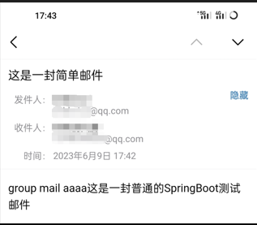

 
:::info 目录
**RocketMQ** 
    
**Spring集成RocketMQ**  

**Springboot集成RocketMQ**   

**邮件服务**
::: -->
<!--truncate-->

##  RocketMQ
``` bash title="启动mq"
启动nameserver: nohup sh bin/mqnamesrv &
查看nameserver是否启动成功: tail -f ~/logs/rocketmqlogs/namesrv.log
启动broker: nohup sh bin/mqbroker -n localhost: 9876 &
查看broker是否启动成功: tail -f ~/logs/rocketmqlogs/broker.log
查看端口号占用情况: netstat -antup
关闭Nameserver sh bin/mqshutdown namesrv
关闭Broker sh bin/mqshutdown broker
//启动服务之间的网段问题
nohup sh bin/mqbroker -n localhost:9876 -c conf/broker.conf & 
修改conf/broker.conf，末尾添加
 namesrvAddr = 192.168.78.134:9876
 brokerIP1 = 192.168.78.134 
//启动GUI 
java -jar mq-console.jar 
host:17890
```
## Spring集成RocketMQ
``` xml title="依赖"
<dependency> 
    <groupId>org.apache.rocketmq</groupId> 
    <artifactId>rocketmq-spring-boot-starter</artifactId> 
    <version>2.0.3</version> 
</dependency>
```

``` yml title="配置"
rocketmq:
 name-server: 192.168.78.134:9876
 producer:
   group: test-group
```

``` java titile="使用"
@Autowired
private RocketMQTemplate rocketMQTemplate;
@GetMapping("/mq")
public ResultVo mq(){
    List<Integer> x = new ArrayList<>();
    x.add(1);x.add(2);
    Group a = new Group(3,"awd",x);
    rocketMQTemplate.convertAndSend("gg",a); 
    return ResultVo.DEFAULT_SUCCESS;
} 
```

## Springboot集成RocketMQ

``` xml title="依赖"
<dependency>
    <groupId>com.alibaba.cloud</groupId>
    <artifactId>spring-cloud-starter-stream-rocketmq</artifactId>
</dependency>
```

``` yml title="配置"
cloud: 
stream:
    rocketmq:
    binder:
        name-server: 192.168.78.134:9876
        group: mail-group
    bindings:
    output:
        destination: mail-group
```

``` java titile="使用"
//启动类注解
@EnableBinding(Source.class)

//service
@Autowired
private Source source;

@GetMapping("/mail")
public ResultVo mail(){
    source.output().send(MessageBuilder.withPayload("group mail aaaa").build());
    return ResultVo.DEFAULT_SUCCESS;
}
//消费在邮件服务中使用
```
## 邮件服务
:::tip 
**使用RocketMQ实现异步**
:::
``` xml title="依赖"
<dependency>
    <groupId>com.alibaba.cloud</groupId>
    <artifactId>spring-cloud-starter-stream-rocketmq</artifactId>
</dependency>
<dependency>
    <groupId>org.springframework.boot</groupId>
    <artifactId>spring-boot-starter-mail</artifactId>
</dependency>
<dependency>
    <groupId>cn.hutool</groupId>
    <artifactId>hutool-all</artifactId>
    <version>5.8.19</version>
</dependency>
```

``` yml title="配置"
server:
  port: 5001
spring:
  datasource:
    driver-class-name: com.mysql.cj.jdbc.Driver
    url: jdbc:mysql://localhost:3306/school?serverTimezone=GMT%2B8&characterEncoding=utf8&useSSL=true
    username: root
    password: root
  cloud:
    stream:
      rocketmq:
        binder:
          name-server: 192.168.78.134:9876
          group: mail-group
      bindings:
        input:
          destination: mail-group
  mail:
    host: smtp.qq.com
    #默认端口号465
    #port: 465
    username: x@qq.com
    password: ujzajpbmrniuefgb
    protocol: smtp
    test-connection: true
    default-encoding: UTF-8
    properties:
      mail:
        smtp:
          auth: true
          starttls:
            enable: true
            required: true  
```

``` java titile="使用"
//启动类注解 rocketmq 消费
@EnableBinding(Sink.class)


@Autowired
private JavaMailSender mailSender; 

@Value("${spring.mail.username}")
private String from;  

//消费在邮件服务中使用
@StreamListener(Sink.INPUT)
public void sendmail(String message){
    System.err.println(message);
    sendSimpleMail("xx@qq.com", "这是一封简单邮件", message+"这是一封普通的SpringBoot测试邮件");
}
/**
 * 发送文本邮件
 *
 * @param to      收件人地址
 * @param subject 邮件主题
 * @param content 邮件内容
 * @param cc      抄送地址
 */
@Override
public void sendSimpleMail(String to, String subject, String content, String... cc) {
    SimpleMailMessage message = new SimpleMailMessage();
    message.setFrom(from);
    message.setTo(to);
    message.setSubject(subject);
    message.setText(content);
    if (ArrayUtil.isNotEmpty(cc)) {
        message.setCc(cc);
    }
    mailSender.send(message);
} 
```
:::info 运行效果 

:::