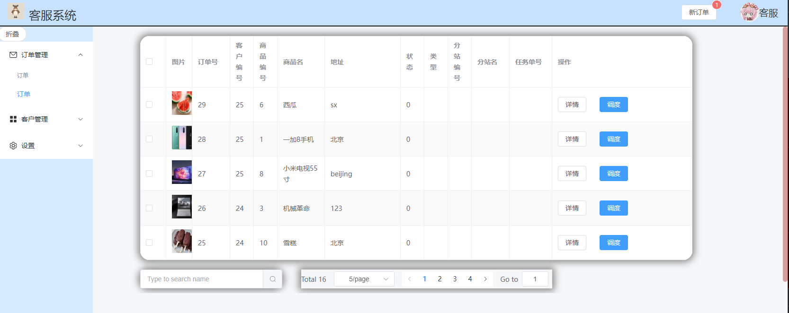

  
:::caution 目录
**sse(server-sent event)**  
**前端Vue 后端Spring**  
::: -->
<!--truncate-->

:::info 运行效果 

:::
 
### SSE
SSE （ Server-sent Events ）是 WebSocket 的一种轻量代替方案，使用 HTTP 协议。  

严格地说，HTTP 协议是没有办法做服务器推送的，但是当服务器向客户端声明接下来要发送流信息时，客户端就会保持连接打开，SSE 使用的就是这种原理。  

SSE 是 Server-Sent Events 的简称， 是一种服务器端到客户端(浏览器)的单项消息推送。  

相比于 WebSocket，SSE 简单不少，服务器端和客户端工做量都要小不少、简单不少，同时实现的功能也有局限。   

###  Vue前端实现
``` js title="EventSouce"
onMounted(() => { 
  createEventSource();   
})
let source = null;
const createEventSource = () => { 
    if (window.EventSource) {

        // 建立连接
        let token = localStorage.getItem("cs_token")
        source = new EventSource('http://localhost:9000/cs-service/sse/subscribe?token='+token,  
       );  

        source.addEventListener('open', function (e) {
            console.log("建立连接");
        }, false);
       
        source.addEventListener('message', function (e) {
            console.log(e.data);
            ssedata.text = e.data
            cnt.value++
        });
    
        source.addEventListener('finish', function (e) { 
            console.log(e.data);
        });

    } else {
        console.log("你的浏览器不支持SSE");
    } 
};
window.onbeforeunload = function() {
     closeSse();
 };

// 关闭Sse连接
function closeSse() {
    source.close();
    const httpRequest = new XMLHttpRequest();
    let token = localStorage.getItem("cs_token")
    httpRequest.open('GET', 'http://localhost:9000/cs-service/sse/over?token=' +token  );
    httpRequest.send();
    console.log("close");
} 
```


### 后端
``` java title="controller"
@Controller
@RequestMapping(path = "sse")
public class SseController {

    private final static Map<String, SseEmitter> sseCache = new ConcurrentHashMap<>();


    @GetMapping(path = "subscribe", produces = {MediaType.TEXT_EVENT_STREAM_VALUE})
    public SseEmitter create(@RequestParam(name = "token", required = true)String token) throws IOException {

        Claims claims = JwtUtil.parse(token);
        String csId;
        if (claims == null) {
            return  null;
        }else{
             csId = claims.getSubject();
        }
        // 超时时间设置为5分钟，用于演示客户端自动重连
        SseEmitter sseEmitter = new SseEmitter(5_60_000L);
        // 设置前端的重试时间为1s
        // send(): 发送数据，如果传入的是一个非SseEventBuilder对象，那么传递参数会被封装到 data 中
        //sseEmitter.send(SseEmitter.event().reconnectTime(1000).data("连接成功"));
        sseCache.put(csId, sseEmitter);
        System.out.println("add " + csId);
       // System.out.println("现在有"+sseCache.size()+"客服");
        //sseEmitter.send("你好", MediaType.APPLICATION_JSON);
       // SseEmitter.SseEventBuilder data = SseEmitter.event().name("finish").id(csId).data("你好"+csId);
       // sseEmitter.send(data);
        // onTimeout(): 超时回调触发
        sseEmitter.onTimeout(() -> {
            System.out.println(csId + "超时");
            sseCache.remove(csId);
        });
        // onCompletion(): 结束之后的回调触发
        sseEmitter.onCompletion(() -> System.out.println("完成！"));
        return sseEmitter;
    }


    @ResponseBody
    @GetMapping(path = "push")
    public String push( String content) throws IOException {

        Set<Map.Entry<String,SseEmitter>> entries=sseCache.entrySet();
        System.out.println("需要push"+sseCache.size());
        for (Map.Entry entry:entries){
            SseEmitter sseEmitter = (SseEmitter) entry.getValue();
            if (sseEmitter != null) {
                sseEmitter.send(content);
            } 
        }

        return "over";
    }

    @ResponseBody
    @GetMapping(path = "over")
    public String over(String token) {
        Claims claims = JwtUtil.parse(token);
        String csId;
        if (claims == null) {
            return  "异常";
        }else{
            csId = claims.getSubject();
        }
        SseEmitter sseEmitter = sseCache.get(csId);
        if (sseEmitter != null) {
            // complete(): 表示执行完毕，会断开连接
            sseEmitter.complete();
            sseCache.remove(csId);
            System.out.println("清除"+csId);
        }
        return "over";
    }
}
```

### 业务调用
```java
@FeignClient(name="cs-service")
public interface CsServiceFeignClient {
    @GetMapping("/sse/push")
    String push(@RequestParam String content) throws IOException;
}

new Thread(() -> {        
    try{
        Thread.sleep(5000);
        String res = csServiceFeignClient.push("yctf");
    }catch (InterruptedException e){
        e.printStackTrace();
    } catch (IOException e) {
        throw new RuntimeException(e);
    }    
}).start();

```