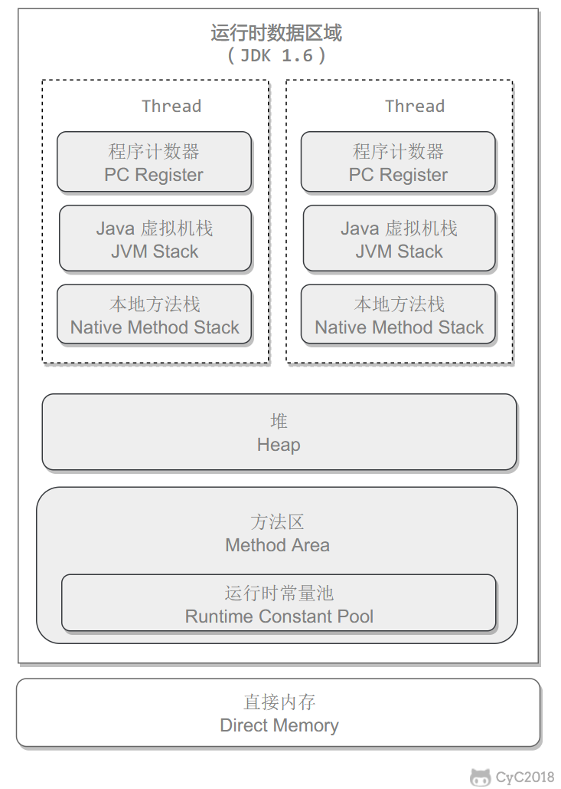

---
sidebar_position: 2
--- 

```
流行JVM
●  Sun ： HotSpotJava HotSpot(TM) 64-Bit Server VM (build 25.181-b13, mixed mode) 
●  BEA :   JRockit 
●  IBM:    J9VM
绝大部分开发任务使用HotSpot
```

## JVM结构



```
 Stack
	栈是运行时的单位,JVM虚拟机栈属于线程私有，生命周期即为线程的生命周期，每一个方法在栈中都有一个栈帧，每当一个线程中的方法被调用，该方法作为一个栈帧入栈，执行结束出栈，每个栈帧中都有着父子栈帧的指针，使得子栈帧出栈之后能够继续运行父栈帧的代码。

栈中存储的数据有以下几种： 
  a.  局部变量表： 存放了编译期可知的各种基本数据类型变量(值变量)、对象引用以及returnAddress(指向一条字节码指令的地址) 
  b.  操作数栈 
    ■ 工作：在方法执行过程中，根据字节码指令，往操作数栈中写入或者读出数据。
    ■ 作用：存储计算过程的中间结果以及作为计算过程中变量临时的存储空间 。所调用方法的返回值也会存储在操作数栈中 。
    ■ 初始化： 在一个栈帧初始化的时候（一个方法被调用），会创建一个新的操作数栈 。这个操作数栈在创建初始期为空，但大小max_stack在编译期间就被确定 ，并被保存于方法的Code属性中。
    ■ 存放数据：操作数栈可以存放任何Java数据类型 
      ● 32位数据占据1个深度
      ● 64位数据占据2个深度

  c. 动态链接
	每个栈帧都包含一个指向运行时常量池中该栈帧所属方法的引用，持有这个引用是为了支持方法调用过程中的动态连接(Dynamic Linking)。 
  d.  方法返回地址
当一个方法开始执行的时候，只有两种方式可以退出： 
    ⅰ. 遇到方法返回的字节码指令 return
    ⅱ. 遇到异常并且该异常没有被处理
存储方法调用者的程序计数器值等信息来返回上层方法


调优与异常
	可以通过-Xss参数来指定每个线程的Java栈内存大小 ，JDK1.4默认为256K,JDK1.5+默认为1M

java -Xss

Java虚拟机栈可能会抛出两种异常： 
  ○ 线程请求的栈深度达到了最大值 ，抛出StackOverflowError
  ○ 栈进行动态扩展的时候如果无法申请到足够的内存，抛出OutOfMemoryError异常，在HotSpot虚拟机中栈不会动态扩展

 本地方法栈
	本地方法栈与Java虚拟机栈类似，但是本地方法栈为本地方法服务 。 使用native关键字修饰的方法会被加载到本地方法栈 ，当方法调用的时候会通过本地方法接口JNI调用对应的本地方法库

以上例子是Thead类中的start()方法所调用的方法，native关键字代表这个方法的底层是C写的，Java中无法调用 
    ⅰ. native方法调用会进入本地方法栈
    ⅱ. 本地方法栈中调用本地方法接口JNI
    ⅲ. JNI的作用是使用Java调用其他的语言
本地方法栈是内存区域中开辟的单独一块标记区域 ：Native Method Stack 用来登记native方法，最终通过JNI执行本地方法库中的方法 

程序计数器
	一个记录着当前线程所执行的字节码的行号指示器。 作用是指示程序字节码的跳转 。每个线程都有自己的程序计数器。程序计数器是唯一一个在Java虚拟机规范中不存在OOM的区域。 


4. 堆 
  ○  JVM虚拟机中最大的一块运行时内存区域，存放的是在各个线程中实际被new出来的对象以及数组 ，即栈中的引用指向的是堆中的实际对象。 
  ○  堆的特点是所有线程共享，程序中的所有线程都可以访问堆中的数据，例如多线程可以去读写同一个对象 
  ○  JVM在堆中进行内存调优与GC垃圾回收 ， 所以堆又被称为GC堆 
  ○  堆在逻辑上被分为了三个个部分：

  


```

## GC垃圾回收