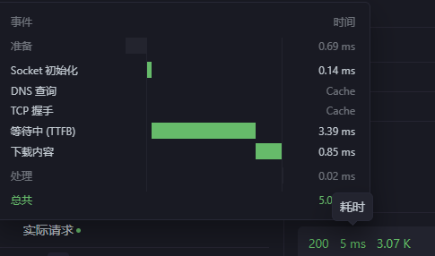

# redis 使用

##  Redis介绍

Redis(Remote Dictionary seve)，即远程字典服务，
是一个开源的使用ANSIC语言纳写、支持网络、可基于内存亦可特久化的日志型、Key-value库，
Redis是一种面向"Key-Value"类型的内存数据库，可以满足我们对海量数据的快速读写要求- Redis的Key只能是字符串，value可以是多种类型  
Redis特点  
 高性能:Redisi读的速度是11w次/s，写的速度是8.1w次/s    
 原子性:保证数据的准确性  
 持久存储:支特两种持久化方案，RDB和AOF  
 支持主从模式和集群模式，(3.0开始支持集群)  
- Redis是—个单线程的服务(6.x的新特性开始支持多线程)
- Redlis是一个NoSQL数据库
- Redis的应用场景
https;//www.jianshu.com/p/40dbc78711c8
 redis是一个单线程C程序 ，是通过I/O多路复用实现的。 
redis将所有的数据放在内存中，如果使用多线程会造成频繁的上下文切换从而影响效率。对于内存来说不进行上下文切换会最大化利用资源，因此redis使用单线程来实现，但是并发通过多路复用实现。
 五大数据类型:String字符串,List列表,set集合,哈希类型 Map集合 命令以h开头,Zset有序集合 
:::tip  三种特殊数据类型
**geospatial地理位置 redis-3.2可以用来推算地理位置的信息** 
**Hyperloglog-> redis-2.8.9+基数统计算法,优点：占用的内存固定(12KB),缺点：正确率为81%**
**BitMap位图使用位图存储，适用于存储具有两个状态的数据，位运算计算速度快，同时耗费的资源比较少**
:::

:::info  net
**本机网络需要配置虚拟机网络适配器并配置网段**   
:::

## Redis 锁
``` js
开启事务  multi 
执行事务  exec 
#陆续执行事务中的所有命令
放弃事务(取消事务) discard
悲观锁
	以悲观的角度看待事务，认为事务的问题频发，因此无论做什么都会加锁。
乐观锁
1. 以乐观的角度看待事务，认为事务的问题不常有，所以不会上锁。在更新数据的时候去判断，查看在此期间是否有人修改过这个数据
2. watch会监控某个数据，在事务执行的时候会判断这个数据是否被修改了。如果被修改了事务就不会执行，否则成功执行。
3. unwatch 事务执行失败就先解锁，获取最新的值之后重新watch上锁
```
 


<!-- :::note  
**content**  
:::

:::tip 
**content**  
::: -->


<!-- :::caution 
**content**  
:::

:::danger  
**content**  
::: -->


:::info
**redis-server redis.conf 设置启动模式等**
**缓存对象实现序列化**   
::: -->


``` bash title="redis命令"
———————————————— 
大小写不敏感
切换数据库 select 3 
查看数据库大小 DBSIZE
清空全部数据库内容flushall
清空当前数据库flushdb
删除key: del abc  
查看所有符合模板的key： keys * 
判断key是否存在exists: exists abc
给存在的key设置有效期,到期会删除key: EXPIRE abc 5
TTL	查看key的剩余有效期 
返回 -2 过期
返回 -1 就是存在且没有过期时间
:TTL ttl abc
———————————————— 
HELP [command]	查看命令的具体用法:
SET [key] [value]	添加或者修改已经存在的一个 String 类型的键值对
GET [key]	根据 key 获取 String 类型的 value
MSET [key] [value] ( [key] [value] …)	批量添加多个 String 类型键值对
MGET [key] ( [key] …)	根据多个key获取多个String类型的value
INCR [key]	让 key 自增1个
INCRBY [key] [increment]	让 key 自增 increment 个
INCRBYFLOAT [key] [increment]	让浮点型 key 自增 increment 个
SETNX [key] [value]	添加一个String类型键值对, 前提key不存在,否则不执行
SETEX [key] [second] [value]	添加一个String类型键值对并指定有效时间 
———————————————— 
HSET [key] [field] [value] ([filed] [value] …)	添加或者修改hash类型key的field的值
HGET [key] [field]	获取一个hash类型key的field的值
HMSET [key] [field] [value] ([filed] [value] …)	批量添加多个hash类型key的field的值
HMGET [key] [field] ( [field] …)	批量获取多个hash类型key的field的值
HGETALL [key]	获取hash类型的key中所有的field和value
HKEYS [key]	获取一个hash类型的key中所有的field
HVALS [key]	获取一个hash类型的key中所有的value
HINCRBY [key] [field] [increment]	让hash类型key的字段自增
HSETNX [key] [field] [value]	添加一个hash类型的key的field的值, 如果存在就不执行
———————————————— 
LPUSH [key] [element] ([element] …)	向左侧插入一个或者多个元素
LPOP [key]	移除并返回列表左侧的第一个元素, 没有返回nil
RPUSH [key] [element] ([element] …)	向右侧插入一个或者多个元素
RPOP [key]	移除并返回列表右侧第一个元素, 没有返回nil
LRANGE [key] [start] [stop]	返回一段范围内的所有元素
BLPOP [key] ([key]…) [timeout]	在没有元素的时候等待指定时间, 而不是返回nil
BRPOP [key] ([key]…) [timeout]	在没有元素的时候等待指定时间, 而不是返回nil
————————————————
 特点: 1. 无序 2. 元素不可重复 3. 查找快 4. 支持交集. 并集, 差集功能  
SADD [key] [member] ([member] …)	添加一个元素
SREM [key] [member] ([member] …)	删除一个元素
SCARD [key]	返回元素个数
SISMEMBER [key] [member]	判断是否存在一个元素
SMEMBERS [key]	获取所有的元素
SINTER [key] ([key] … )	求key1 和 key2的交集
SDIFF [key] ([key] … )	求key1 和 key2的差集
SUNION [key] ([key] … )	求key1 和 key2的并集
————————————————
SortedSet 类型
是一个可排序的Set集合,特点: 1. 可排序 2. 元素不重复 3. 查询速度快 
ZADD [key] [score] [member] ([score] [member] …)	添加一个或者多个元素, 如果存在,更新score值
ZREM [key] [member] ([member] …)	删除指定元素
ZSCORE [key] [member]	获取指定元素的score值
ZRANK [key] [member]	获取指定元素的排名
ZCARD [key]	获取元素个数
ZCOUNT [key] [min] [max]	统计指定范围内的元素个数
ZINCRBY [key] [increment] [member]	
ZRANGE [key] [min] [max]	获取指定排名范围内的元素
ZRANGEBYSCORE [key] [min] [max]	获取指定score范围内的元素
ZDIFF [numkeys] key ([key] …)	差集
ZINTER [numkeys] key ([key] …)	交集
ZUNION [numkeys] key ([key] …)	并集
————————————————  
```


##  Springboot集成Redis

在SpringBoot-2.x中Jedis变为了lettuce
● jedis采用直连，线程不安全，如果要更加安全需要使用jedis pool连接池
● lettuce采用netty,实例可以在多个线程中共享，不存在线程不安全的情况

``` xml title="导入依赖"
<dependency>
    <groupId>org.springframework.boot</groupId>
    <artifactId>spring-boot-starter-data-redis</artifactId>
</dependency>
```

 
``` yml title="yml"
spring:
  redis: 
      database: 0
      host: 192.168.78.134
      port: 6379
      password:
      jedis:
        pool:
          #最大连接数
          max-active: 8
          #最大阻塞等待时间(负数表示没限制)
          max-wait: -1
          #最大空闲
          max-idle: 8
          #最小空闲
          min-idle: 0
          #连接超时时间
      timeout: 10000
```

 
``` js  title="redisconfig"
@Configuration 
public class RedisConfig extends CachingConfigurerSupport {
    @Bean(name = "redisTemplate")
    public RedisTemplate<String, Object> redisTemplate(RedisConnectionFactory redisConnectionFactory){

        RedisTemplate<String, Object> redisTemplate = new RedisTemplate<>();
        //参照StringRedisTemplate内部实现指定序列化器
        redisTemplate.setConnectionFactory(redisConnectionFactory);
        redisTemplate.setKeySerializer(keySerializer());
        redisTemplate.setHashKeySerializer(keySerializer());
        redisTemplate.setValueSerializer(valueSerializer());
        redisTemplate.setHashValueSerializer(valueSerializer());
        return redisTemplate;
        /*
        //opsForValue操作字符串
        redisTemplate.opsForValue().set("name","luyuandong");
        //操作list
        redisTemplate.opsForList();
        //操作Set
        redisTemplate.opsForSet();
        //操作排序集合
        redisTemplate.opsForZSet();
        //Map
        redisTemplate.opsForHash();
        //地理数据
        redisTemplate.opsForGeo();
        //基数统计
        redisTemplate.opsForHyperLogLog();
        //常用的方法可以直接通过redisTempalte操作(事务以及基本的增删改查)
        redisTemplate.multi(); //开启事务
        redisTemplate.discard(); //放弃事务
        redisTemplate.exec(); //执行事务
        //获取连接
        RedisConnection connection = redisTemplate.getConnectionFactory().getConnection();
        //所有的操作也可以直接通过connection来完成
        connection.multi(); //事务
        connection.flushDb();
        connection.del(new byte[]{Byte.valueOf("name")});
        */
    }

    private RedisSerializer<String> keySerializer(){
        return new StringRedisSerializer();
    }

    //使用Jackson序列化器
    private RedisSerializer<Object> valueSerializer(){
        return new GenericJackson2JsonRedisSerializer();
    }
}
```

  
``` java title="redistemplate" 

  // highlight-start
   @Autowired
    private RedisTemplate redisTemplate;
  // highlight-end 

    @GetMapping("/all")
    public ResultVo getAllStudent(){ 

        ResultVo all = new ResultVo();
        if(redisTemplate.opsForValue().get("all")==null){
            all = studentService.getAllStudent();
           // redisTemplate.opsForValue().set("all", all ,6, TimeUnit.SECONDS);
            redisTemplate.opsForValue().set("all", all );
            System.out.println("mysql");
            System.out.println(all);
        } else{
            System.out.println("redis");
            System.out.println(redisTemplate.opsForValue().get("all"));
        } 
        return studentService.getAllStudent();
    }
```


## spring-cache

 :::tip
**需要配置redis,spring-cache自动寻找缓存** 
::: -->

``` xml title="导入依赖"
<dependency>
    <groupId>org.springframework.boot</groupId>
    <artifactId>spring-boot-starter-cache</artifactId>
</dependency>
```

``` java title="添加启动类注解"
@SpringBootApplication
@MapperScan("com.bkbk.school.mapper")
@EnableCaching
public class SchoolApplication {

    public static void main(String[] args) {
        SpringApplication.run(SchoolApplication.class, args);
    }

}
```


```java title="crud" 
     
    @CacheEvict("all-stu")
    @GetMapping("/delcache")
    public ResultVo delchahe() {
        return ResultVo.success();
    } 

    @CachePut("all-stu")
    @GetMapping("/putcache")
    public ResultVo putchahe() {
       return ResultVo.success();
    } 


    @Cacheable("all-stu")
    @GetMapping("/all")
    public ResultVo getAllStudent(){  
        return studentService.getAllStudent();
    }

```

``` java title="设置缓存后缀"
@Component("myKeyGenerator")
public class MyKeyGenerator implements KeyGenerator {
    @Override
    public Object generate(Object target, Method method, Object... params) { 
        return "";
    }
}
@Cacheable(value = "all-stu" ,keyGenerator = "myKeyGenerator" )
@GetMapping("/all")
public ResultVo getAllStudent(){
    return studentService.getAllStudent();
}

@CacheEvict(value = "all-stu" ,keyGenerator = "myKeyGenerator" )
@GetMapping("/delcache")
public ResultVo delchahe() {
    return ResultVo.success();
}
```


## 性能
./redis-benchmark -h localhost -p 6379 -c 100 -n 10000
redis:  
   
mysql:  
  